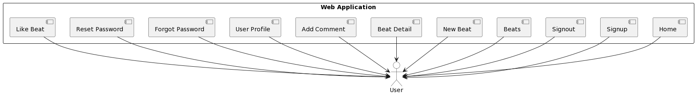
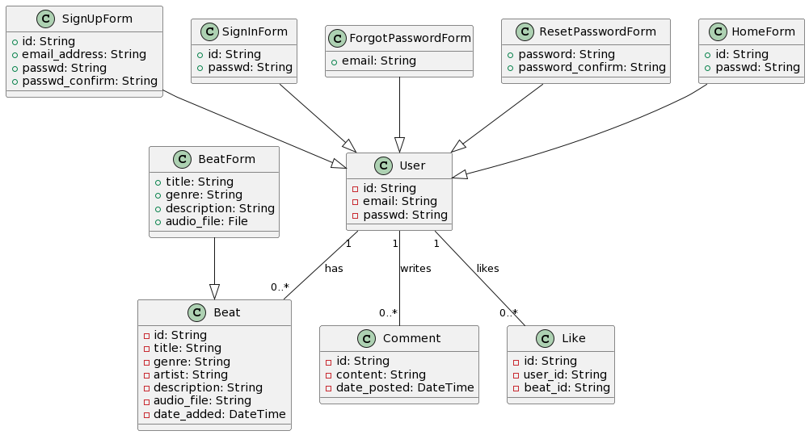
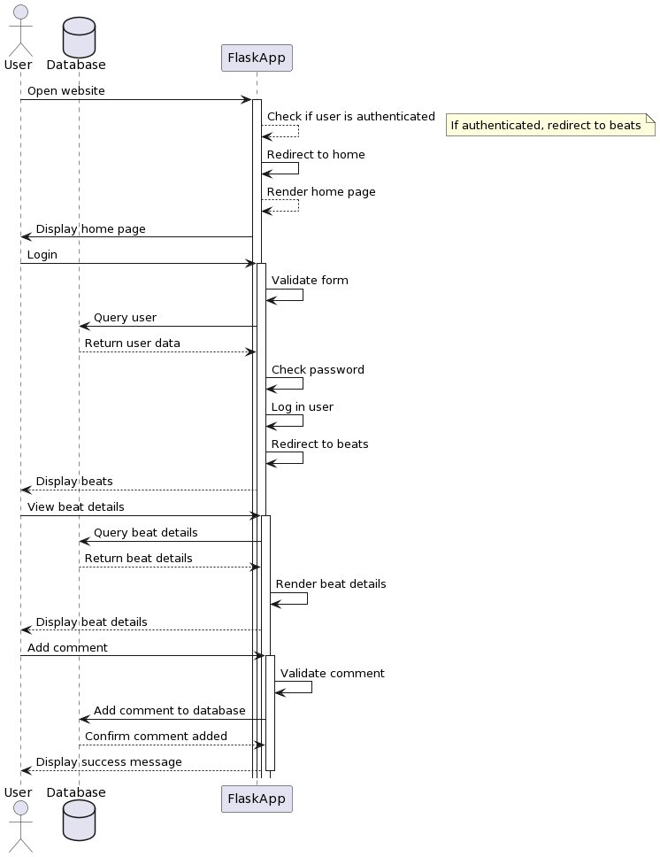

# Beat-Layer

## Overview
Beat Layer is a dynamic online platform designed for musicians and artists seeking collaborative synergy. By allowing users to contribute their unique 'layers' to existing beats, the app facilitates a musical dialogue where each addition enriches the original track. This virtual studio space not only fosters creativity but also archives the evolution of a beat as it transforms with each new contribution. It's a place where the solitary act of music creation becomes a communal journey, resulting in a tapestry of sounds that reflects the collective genius of its contributors.

In its current form, the app stands as an innovative platform for music sharing, a digital space where melodies intertwine and rhythms find their audience. But this is just the beginning. Envision a future where the app transcends its initial boundaries, evolving into an extraordinary realm of musical creation.

Imagine the introduction of a groundbreaking beat layering functionality, a feature that promises to revolutionize the way music is crafted and experienced. This will not be just an update; it's a metamorphosis, elevating the app from a mere sharing platform to an artistic forge, where users don't just share music – they create it.

In this future, users will weave intricate tapestries of sound, layering beats upon beats, crafting unique musical experiences that blur the lines between creator and listener. Each user becomes a maestro, orchestrating symphonies of their own design, in a collaborative and immersive environment that pushes the boundaries of digital music creation.

This is more than an app; it's a new horizon in the music industry, a frontier where technology meets art, where every note holds the promise of innovation, and every beat echoes the heartbeat of creativity. The journey ahead is charged with potential, a symphony waiting to be written in the universal language of music.

## Design

### User Stories

#### US#1
As a songwriter, I want to upload my guitar track with a title and description, so other musicians can understand my vision and add their layers. (DONE)

#### US#2
As a collaborator, I want to leave feedback on tracks in progress, so I can help improve the collaboration and engage with other users. (DONE)

#### US#3
As a new user, I want to easily navigate through the app so that I can quickly understand its functionalities.(DONE)

#### US#4
As a song uploader, I want to receive constructive feedback on my unfinished tracks, so I can make informed decisions on how to develop them further. (DONE)

#### US#5
As a musician, I want to easily share my recordings with collaborators, so we can quickly exchange ideas and work on the tracks. (DONE)

#### US#6
As a musician, I want to search for songs by genre or artist, so I can find collaborations that match my interests and skills. (IP)

#### US#7
As a collaborator, I want to track the progress of songs I'm involved in, so I can see how they evolve over time. (NOT DONE)

#### US#8
As a returning user, I want to see highlighted collaborations or trending songs on the home page, so I can explore popular content. (NOT DONE)

#### US#9
As a collaborator, I want to be able to download the final version of a song, so I can use it in my own projects. (NOT DONE)

### Model

#### Use Case Diagram



```
@startuml

actor User as AUTHUSER

rectangle "Web Application" {
  [Home]
  [Signup]
  [Signout]
  [Beats]
  [New Beat]
  [Beat Detail]
  [Add Comment]
  [User Profile]
  [Forgot Password]
  [Reset Password]
  [Like Beat]

  [Home] --> (AUTHUSER)
  [Signup] --> (AUTHUSER)
  [Signout] --> (AUTHUSER)
  [Beats] --> (AUTHUSER)
  [New Beat] --> (AUTHUSER)
  [Beat Detail] --> (AUTHUSER)
  [Add Comment] --> (AUTHUSER)
  [User Profile] --> (AUTHUSER)
  [Forgot Password] --> (AUTHUSER)
  [Reset Password] --> (AUTHUSER)
  [Like Beat] --> (AUTHUSER)
 }

 @enduml
```

#### Class Diagram



```
@startuml

class User {
  - id: String
  - email: String
  - passwd: String
}

class Beat {
  - id: String
  - title: String
  - genre: String
  - artist: String
  - description: String
  - audio_file: String
  - date_added: DateTime
}

class Comment {
  - id: String
  - content: String
  - date_posted: DateTime
}

class Like {
  - id: String
  - user_id: String
  - beat_id: String
}

class SignUpForm {
  + id: String
  + email_address: String
  + passwd: String
  + passwd_confirm: String
}

class SignInForm {
  + id: String
  + passwd: String
}

class BeatForm {
  + title: String
  + genre: String
  + description: String
  + audio_file: File
}

class ForgotPasswordForm {
  + email: String
}

class ResetPasswordForm {
  + password: String
  + password_confirm: String
}

class HomeForm {
  + id: String
  + passwd: String
}

User "1" -- "0..*" Beat : has
User "1" -- "0..*" Comment : writes
User "1" -- "0..*" Like : likes
SignUpForm --|> User
SignInForm --|> User
BeatForm --|> Beat
ForgotPasswordForm --|> User
ResetPasswordForm --|> User
HomeForm --|> User

@enduml
```

#### Sequence Diagram



```
@startuml

actor User

database Database

User -> FlaskApp: Open website
activate FlaskApp
FlaskApp --> FlaskApp: Check if user is authenticated
note right: If authenticated, redirect to beats
FlaskApp -> FlaskApp: Redirect to home
FlaskApp --> FlaskApp: Render home page
FlaskApp -> User: Display home page

User -> FlaskApp: Login
activate FlaskApp
FlaskApp -> FlaskApp: Validate form
FlaskApp -> Database: Query user
Database --> FlaskApp: Return user data
FlaskApp -> FlaskApp: Check password
FlaskApp -> FlaskApp: Log in user
FlaskApp -> FlaskApp: Redirect to beats
FlaskApp --> User: Display beats

User -> FlaskApp: View beat details
activate FlaskApp
FlaskApp -> Database: Query beat details
Database --> FlaskApp: Return beat details
FlaskApp -> FlaskApp: Render beat details
FlaskApp --> User: Display beat details

User -> FlaskApp: Add comment
activate FlaskApp
FlaskApp -> FlaskApp: Validate comment
FlaskApp -> Database: Add comment to database
Database --> FlaskApp: Confirm comment added
FlaskApp --> User: Display success message

deactivate FlaskApp

@enduml
```

## Development Process 

This section should be used to describe how the scrum methodology was used in this project. As a suggestion, include the following table to summarize how the sprints occurred during the development of this project.

|Sprint#|Goals|Start|End|Done|Observations|
|---|---|---|---|---|---|
|1|US#1, US#2|11/24/23|11/30/23|US#1, US#2|No troubles so far making progress but it seems that many stories might not get finished in the short time available|
|2|US#3, US#4, US#5|12/1/23|12/4/23|US#3, US#4, US#5|Steady progress is still being made. We had to throw out some features to get the project done on time but everything is working so far.|
|3|US#6, US#7, US#8, US#9|12/5/23|12/7/23|IP|IP|

Use the observations column to report problems encountered during a sprint and/or to reflect on how the team has continuously improved its work.

Feel free to use your own format for this section, as long as you are able to communicate what has been described here.

## Testing

### black-box testing
1. Index Page:
  - Open the application and navigate to the sign in page..
  - Verify that if a user is authenticated, it redirects to the "/beats" page.
  - Verify that if a user is not authenticated, it redirects to the "/home" page.
2. Home Page:
  - Navigate to the home page ("/home").
  - Submit the form with valid credentials and verify that it redirects to the "/beats" page.
3. Sign Up Page:
  - Navigate to the sign-up page ("/users/signup").
  - Verify that the sign-up form is present.
  - Submit the form with a new valid user and verify that it redirects to the "/home" page.
  - Submit the form with an existing email and verify that it displays an error message.
  - Submit the form with non-matching passwords and verify that it displays an error message.
4. Beats Page:
  - Navigate to the beats page ("/beats").
  - Verify that it displays a list of beats.
  - If applicable, test the filter functionality by appending "?genre=<genre>" to the URL.
5. New Beat Page:
  - Navigate to the new beat page ("/beats/new").
  - Verify that the new beat form is present.
  - Submit the form with valid data and verify that it redirects to the "/beats" page.
  - Submit the form with invalid data and verify that it displays appropriate error messages.
6. Beat Detail Page:
  - Navigate to a specific beat detail page ("/beat/<beat_id>").
  - Verify that it displays details of the beat and any associated comments.
  - If applicable, test the functionality to add a comment.
7. User Profile Page:
  - Navigate to the user profile page ("/beat_user/<user_id>").
  - Verify that it displays a list of beats associated with the user.
  - If applicable, test the functionality to delete a beat.
8. My Profile Page:
  - Navigate to the user's profile page ("/my_profile").
  - Verify that it displays details of the currently logged-in user.
9. About Page:
  - Navigate to the about page ("/about").
  - Verify that it displays information about the application.
10. Forgot Password Page:
  - Navigate to the forgot password page ("/forgot_password").
  - Verify that the forgot password form is present.
  - Submit the form with a valid email and verify that it displays a success message.
  - Submit the form with an invalid email and verify that it displays an error message.
11. Reset Password Page:
  - Verify the reset password functionality by following the steps in the password reset email.
12. Like Functionality:
  - Navigate to a beat detail page ("/beat/<beat_id>").
  - Verify that the like functionality works by clicking the like button.
  - Verify that it doesn't allow a user to like the same beat more than once.
13. GitHub Redirect:
  - Navigate to the GitHub page ("/github").
  - Verify that it redirects to the GitHub repository.
14. Log Out:
  - Test the log-out functionality ("/users/signout").
  - Verify that after logging out, it redirects to the index page.
15. Error Handling:
  - Test error handling scenarios by intentionally causing errors, such as submitting forms with missing data or
  invalid inputs.
16. General Application Flow:
  - Navigate through different pages and functionalities to ensure smooth application flow.
  - Check for any unexpected behavior or errors during navigation.

### white-box testing

In order to do white-box testing, we used the coverage package. This package generates a report that shows the percentage of code that was executed during the tests. The report is generated by running the following commands:

```
coverage run unittests.py
```

```
coverage report
```

## Deployment 

### How to deploy the application

1. Clone the repository to your local machine.
2. Create a virtual environment and install the required packages.
```

virtualenv venv

```
3. Activate the virtual environment.
```

source venv/bin/activate

```
4. Install the required packages.
```

pip3 install -r requirements.txt

```
5. Set the environment variables.
(mac)
```

export SECRET_KEY="pikachu"

```
(windows)
```

$env:SECRET_KEY="pikachu"

```
6. Run the application.
```

flask run

```
7. Open the application in your browser.
http://127.0.0.1:5000
8. To stop the application, press Ctrl+C in terminal.
9. HAVE FUN!

```

# Parker - 11/20/23 
## before running the app:
    export SECRET_KEY="pikachu" (mac) / $env:SECRET_KEY="pikachu" (windows)
    pip install -r requirements.txt
    hweaclfuatojowlh (google app pw) (in practice we wouldnt put this in the code but for now its fine)

## what I did today:
- setup the template pretty much as before, except with a slightly different file structure (source code files are all in 'src' for organization)
    ** this makes python do some weird stuff -- we can play around with this if it ends up not being the move, but if importing, you might need to do absolute imports -> 'from src.app import models' (***instead of 'from from app import models').

Setup a basic template for the file structure - Beat (one to many ->) Layer (one to many ->) Stem
- index, base, signin, signup, beats (.html)
- models.py
- forms.py
- routes.py
Setup sign in / sign up / sign out routes
initialized Alembic (handy python package that helps with db migrations)
Some basic testing to make sure the routes were somewhat in working condition

# Simao - 11/24/23
## what I did today:
- changed the 'Beat' model but may be subject to more changes
- added 'beats' 'beats_new' and 'beat_detail' to routes.py
- added 'BeatForm' to forms.py
- added beats.html, beats_new.html, and beat_detail.html to templates
- created function to create new beats
- modified signin and signup slightly
- after sign in takes you to the beats page where you can create a new beat, this adds it to the beats page but no functionality past that yet
- basic testing and so far it looks good just need to add more functionality to the beats page

# Parker - 11/28/23
## testing notes:
- would be nice if the post signin flash was a bit more descriptive
    - adding a header and footer could make me feel less lost
- back to home should take you back to beats page, not to sign in page
- add profiles ?
    
## done:
- added new description under overview (below in readme)
- referenced user id's in created by fields users table (foreign key)
- changed date to datetime for specifity
- back to home goes to 'beats' instead of index
- added audio_file stuff 
    takes audio file from form
    saves it to src/app/uploads
    you can play the song from beat-detail page

# Simao - 11/29/23
- few chabges to beats page for better readability
- added ability to comment on the beats detials page
- did some overall testing and everything seems to be working fine (so far)

## notes:
- wanted to change the Beat model to add genres but didnt want to have to delete the database and start over
- this is something we should probably do in the future and work on together to figure out what we need to do

# Parker - 11/30/23
- lots of styling: menu bar, dark mode, UX stuff
- forgot password mostly implemented but still not updating the users password. it sends an email though 😄
added genres drop down menu
- cleaned up some file structure stuff (got rid of sign in page. now it's 'home'. if you're already signed in, 'home' returns 'beats'.)

# Simao - 12/1/23
- added likes to beats
    - user can only like a beat once
- changed some layouts and added some styling
- made pages scrollable
- footer is now at the bottom of the page
- header is now fixed at the top of the page
- signup page style fix
- create new beat page style fix
- beats page style fix
    - still could use some work

# Simao - 12/4/23
- added search by genre functionality
- updated read me to feature information about the project

# Parker:
12/6/23:
- added profile pic
-working forgot password
-lots of styling
- display profile pic on beat w/ sql join

12/7/23
-download the beat from beat detail
- like the beat from detail
-lots of new genres
-pep8 formatting for routes.py
- fixed JPEG glitch

# Simao - 12/7/23:
- big update to read me
- coverage testing finished

# Needed Changes
## Parker
- update the beat cards (DONE)
- add a profile page (DONE)
- add a profile picture (DONE)
- add a bio (DONE)
- fix create new beat form page so input field widths are not the whole page (DONE)
## Simao
- add sorting to beats page (DONE)
- make functionable with docker
## Rye
- create a use case diagram (DONE)
- create a class diagram (DONE)
- create a sequence diagram (DONE)
- create a vision statement (The project must have a vision statement that describes what the purpose of the software is, the type of problem it tries to solve, and the target audience.) (DONE)
- At least one white-box and one black-box test, none of them related to user creation or authentication, must be provided. (DONE)
## All
- The main branch must be protected and require a code review before a pull request approval. (DONE)
- All source code must have a consistent header comment with a brief description and its author. (DONE)
- Code written for this project must comply to PEP8 code style standards (DONE)
- Test coverage report must be generated using Python's coverage.

To-Do before tomorrow ends:
•	Fix test to work with coverage (DONE)
•	Docker
•	Make sure requirements is up to date (DONE)
•	How to deploy!!

```
